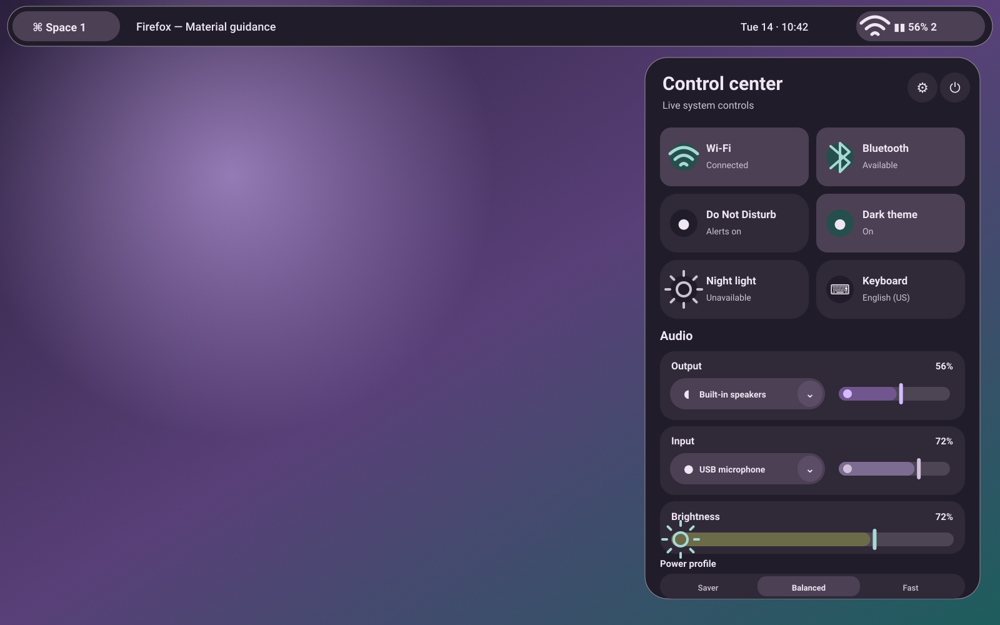
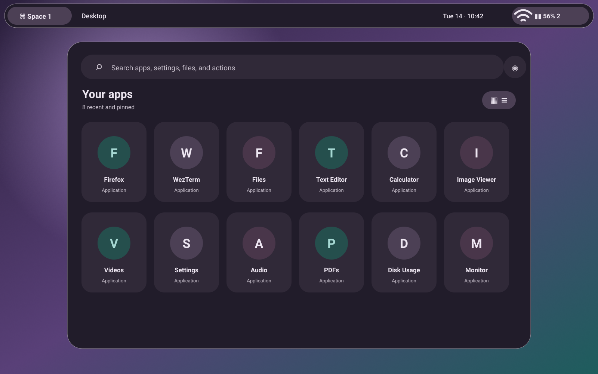
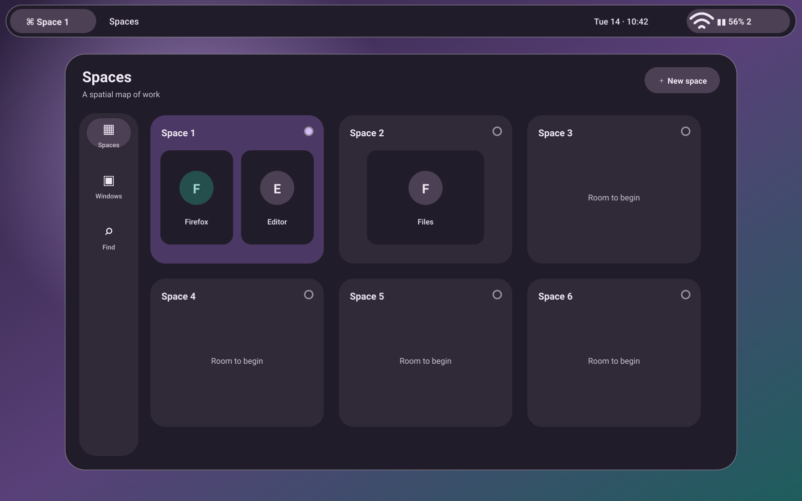

# Motion Shell

**Material motion, desktop scale.** Motion Shell is a Flutter-based desktop shell foundation for Hyprland that treats the bar, launcher, quick settings, notifications, search, spatial workspace overview, OSDs, settings, and session controls as one Material 3 Expressive product.

This repository is a working prototype foundation rather than a theme pack. It contains Flutter surfaces, a crash-isolated state/integration service, Hyprland IPC, command adapters, dynamic wallpaper color extraction, CachyOS bootstrap and deployment scripts, user systemd units, tests, audits, and rendered previews.

## What is implemented

- Shared Material 3 theme plus M3 Expressive token extension, color roles, type, shape, motion, focus, and component themes.
- Dynamic seed extraction from wallpaper pixels with Material Color Utilities scoring, persisted cross-process theme state, and fallback behavior.
- System bar, quick settings, launcher, notifications, search, workspace overview, OSD, and adaptive settings surfaces.
- Package-backed M3E action buttons, icon buttons, connected choice groups, split buttons, loading indicators, and quick-setting adaptations behind Motion-owned wrappers; the slider is explicitly tracked as provisional against the newer 2026 M3E proposal.
- Independent PipeWire/WirePlumber output and input device selection, mute state, and volume controls in the control center.
- Installed application discovery from XDG desktop entries.
- Typed Hyprland event and command socket integration.
- Safe process runner with timeouts, argument separation, errors, and no command interpolation.
- NetworkManager, BlueZ, PipeWire/WirePlumber, brightness, power profile, screenshot, and session adapters.
- Unix-domain state service with subscriber snapshots and local fallback when unavailable.
- Layer-shell wrapper with a regular-window recovery mode.
- Reproducible CachyOS package bootstrap, build, install, uninstall, diagnostics, systemd, portals, GTK, environment, Hyprlock/Hypridle/Hyprpaper, and Hyprland configuration.

## Prototype boundary

The visual and architectural shell is represented end-to-end. Notification ownership on `org.freedesktop.Notifications`, live window thumbnails, full D-Bus-native adapters, multi-monitor surface spawning, secure lock authentication UI, and complete settings coverage remain staged integrations. Existing secure components such as `hyprlock`, logind, polkit, and the desktop portals are used instead of custom password or privilege handling.

## Repository identity

- Product: **Motion Shell**
- Suggested GitHub repository: `motion-shell-wayland`
- Executable: `motion-shell`
- Dart package: `motion_shell`
- User configuration and state namespace: `motion-shell`

The repository slug includes `wayland` to distinguish this project from an unrelated existing project using the Motion-Shell name. The product remains simply **Motion Shell**.

## Build on CachyOS

```bash
./scripts/bootstrap-cachyos.sh
./scripts/build-release.sh
./scripts/install-user.sh
```

The repository pins Flutter 3.44.0 through FVM and CI.

Development showcase:

```bash
fvm flutter run -d linux -- --surface=showcase
```

Individual surfaces:

```bash
fvm flutter run -d linux -- --surface=quick-settings
fvm flutter run -d linux -- --surface=launcher
fvm flutter run -d linux -- --surface=overview
fvm flutter run -d linux -- --surface=settings
```

Run diagnostics:

```bash
./scripts/doctor.sh
```

Publish the clean `main` branch after authenticating GitHub CLI:

```bash
./scripts/publish-github.sh YOUR_GITHUB_USER
```

## Documentation

- [Product definition](docs/PRODUCT.md)
- [Visual system](docs/DESIGN_SYSTEM.md)
- [Technical architecture](docs/ARCHITECTURE.md)
- [Desktop integration](docs/INTEGRATION.md)
- [Application suite](docs/APP_SUITE.md)
- [Audits and limitations](docs/AUDITS.md)
- [Detailed M3 Expressive component audit](docs/M3E_COMPONENT_AUDIT.md)
- [Roadmap](docs/ROADMAP.md)
- [Demo script](docs/DEMO.md)
- [Authoritative references](docs/REFERENCES.md)
- [GitHub staging and publishing](docs/GITHUB_STAGING.md)

## Previews

These are rendered design previews generated from the same product tokens, not captures of a Flutter process. Runtime screenshots require the target CachyOS/Hyprland environment.






## Dependency policy

Motion uses official Flutter Material widgets when they are the strongest semantic implementation and does not call them “M3E” merely because Material 3 is enabled. Current expressive packages for buttons, icon buttons, sliders, loading, and tokens are isolated behind `Motion*` wrappers so they remain replaceable. These are described as package-backed rather than official Flutter M3E implementations, and the slider remains provisional because its size model predates the 2026 XS–XL/vertical proposal. `wayland_layer_shell` is similarly isolated behind `LayerSurfaceHost` because it requires Linux runner changes and has a narrow Wayland-only contract. See the detailed audit for components that remain current M3 rather than expressive.
